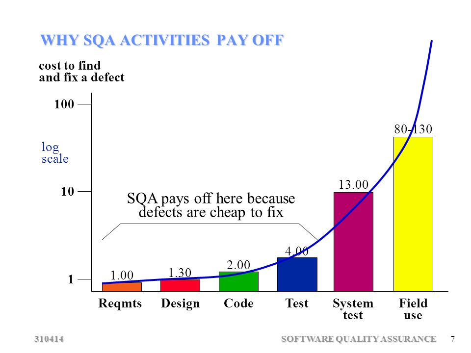
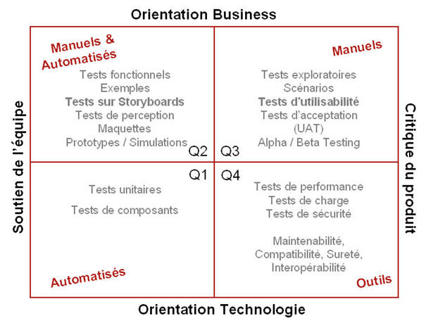

# IFT-6002
## Cours 1

### Interesting Readings
- [Escaping the build trap - Melissa Perri](https://www.mindtheproduct.com/2017/07/escaping-build-trap-melissa-perri/)
- [FlaccidScrum](https://martinfowler.com/bliki/FlaccidScrum.html)
- [Don't touch the DOM](http://www.frontendjunkie.com/2014/12/dont-touch-that-dom-improve-your-web.html)
- [Tests Naming Convention](https://dzone.com/articles/7-popular-unit-test-naming)

### Interesting Comments
- Lorsque identifie un problème, il s'agit d'une hypothèse, nous devons prendre des outils pour prouver que le problème est réel.
- Productivité vs Temps - Développement Logiciel -
Au début, rympte standard, augmente pour atteindre un optimum pour ensuite être stable pendant un certain temps et fini par décroitre tranquillement de plus en plus.
Souvent les gens affaires à titre de réponse à cette décroissance mettra plus de pression sur les gens TI qui finiront par couper sur les tests et la documentation et autre.
Éventuellement le projet ne sera plus viable et sera condamné à mort.
Refactoring: continuellement améliorer le code pour qu'il reste maintenable.
Ne pas confondre avec Big Bang Refactory: prendre un projet existant et tout réécrire en corrigenant ce qui ne fonctionnait pas. S'approche plus d'une refonte.
Refonte: recommencer un projet à 0 en se basant sur les erreurs de l'implantation précédente. Surtout possible dans les grosses compagnies qui ont l'argent pour se payer de tel refonte.
De plus, les refontes ont très peu de valeur ajoutée puisque le logiciel précédent fonctionnait déjà, mais ne répondait plus aux besoins évolutifs.
Double temporairement les effectifs nécessaire à la production et maintient des logiciels.
Nous ne pouvons pas nous débarasser de l'ancienne équipe - seule ayant l'expertise de l'ancien logiciel.
Les mêmes erreurs sont souvent commises à nouveau
Le vrai problème ne réside pas non plus sur les techniques de gestion du projet (AGILE), mais bien sur les méthodes de développement.
Une raison valable pour l'obsolescence d'un logiciel peut-être réellement la technologie, mais il s'agit souvent d'une excuse facile.
De plus, faire de mauvais choix techno devrait rapidement de faire surface, mais encore faut-il avoir un processus pour rapidement ajuster le problème et changer de technologie.
Une bonne qualité d'une technologie est qu'il est facilement de passer de cette technologie à une autre - ne pas être prisonnier de cette technologie
Le plus gros facteur qui fait descendre la courbe de productivité est l'arrogance. (product arrogance - penser que nous savons tout - un succès précédent n'est pas une garantie de succès futur)
- Nous ne sommes plus à l'époque des cowboys, nos erreurs ont des impacts - effet plus grands, plus difficile à identifier, plus longs et compliquer à résoudre
- Coupez les coins ronds mène souvent à des coûts supérieurs dans le futur - le problème c'est que nous mesurons souvent le coût que par le temps de développement

### Qualité Logicielle
- maintenabilité -> long terme
- besoins d'affaires -> utilisateur
- architecture -> permet évolution -> faible couplage/fort cohésion -> relié à la maintenabilité
- testabilité -> relié à la maintenabilité
- fiabilité -> relié à la performance, besoins d'affaires

#### Context Dependent
Pour les items ci-dessous, nous chercherons souvent un juste milieu qui répond à tous les critères
- performance (attention sur-optimisation)
- sécurité

### Développement Durable
- Croissance économique actuelle qui n'impacte pas la génération prochaine à générer la même croissance économique
- Nous pouvons capacité sprint actuel qui n'impacte pas la capacité des sprints futurs
- Problème: nous ne sommes pas une science exacte - très jeune - premier ordinateur ~1960 - web ~1990
- Analogie: bâtisseurs de cathédrales - pas bcp de principes de physique - savoir-faire + attention aux détails ~environ au même stade en génie logiciel
- Solution: se tenir informer des erreurs et expériences de la communauté - ET D'Y CONTRIBUER PLEASE

### Coût de la (mauvaise) qualité
- réputation
- frais de développement
- image de marque
- difficile recruter des bons employés puisqu'ils seront au courant que les pratiques sont mauvaise et que le code base est mauvais
- développement lent

### Automatisation de tests
- roule immédiatement lors du déploiement du build
	- La courbe du nombre de tests n'est pas linéaire avec le nombre de features - probablement plus exponentielle
	- Avoir beaucoup de tests n'est pas exceptionnel
	- cependant, avec le temps, la gestion de risque deviendra plus importante à chaque année
	- permet de les rouler fréquemment 	
	- comment faire quand nous avons trop de tests: gestion de risque - choisir les tests qui seront exécutés durant la période de non-régression
- pourquoi en faire?
	- non-régression - pas briser ce qui est déjà en place
	- s'assurer qu'un bug n'arrive pas à nouveau
	- documenter le code base sur le comportement attendu
	- trouver les tests plus tôt
		
	- on aime pas faire des tests manuels
	- tests manuels sont peu reproductible
- Cadran des tests automatisés
	

	[source](http://www.qualitystreet.fr/2009/03/11/strategie-de-test-qualite-et-agilite-la-vision-qui-change-tout/)

### Test Unitaires
- unitaire vient de unité -> faire des tests en isolation
	- qu'est-ce qu'une unité en OO -> une classe
		- on ne peut y aller à la méthode puisque la classe peut avoir des effets de bords.
	- paradigme fonctionnelle -> une fonction
	- ça veut dire que la plus petite unité isolable est une classe
- CUT -> class under test
- test frappe la classe -> considérer la classe comme une boîte noire (rien connaître de la structure interne)
- test unitaire sont des noyaux, mais il existe plusieurs autres types de tests automatisables
- ils sont écrit pour les développeurs et par les développeurs.
- Analogie: classe sont des blocs lego -> donc les tests s'assurent que chaque bloc est conforme afin de permettre une imbrication sans problème.
- Chaque classe est donc indépendante et reliable
- code coverage n'est pas une métrique infaillible
		- couverture physique pas de couverture logique
		- on peut facilement écrire un test qui exécute toute la classe sans rien vérifier
- On veut tester les branches et non pas tous les cas possibles - pourquoi ce bout de code est présent? Quel est son comportement attendu? Non pas, quel sera la sortie de ce bout de code.
- test unitaire ne devrait pas:
	- parler à la base de données
	- parler à un fichier
	- parler à un autre service
	- être long à exécuter
	- modifier le dom

### Test Driven Development (TDD)
- C'est quoi?
	- Écrire les tests qui vont dire ce que le code à implémenter doit faire
	- Une discipline
		- long à maîtriser
		- nécessite de la patience et rigueur
		- change complètement la notion de penser
- 3 Phases
	1. Écrire un test de manière à ce qu'il échoue
 	1. On écrit le MINIMUM de code pour faire passer le test
 	1. Refactoring - qualité du code + architecture
- Pourquoi ne pas écrire une ligne de code dont un test n'a pas été écrit pour couvrir le code?
	- Parce que l'étape de refactoring se base sur le principe que l'on a une pleine liberté pour changer tout ce qu'on en s'assurant que nous ne brisons rien.

#### DEMO
- On commence pas créer la classe de test
- Premier test: à quoi on s'attend de l'état initial (Rappel: classe = boîte noire)
	- On ne test pas le constructeur directement, on test ce que le constructeur devrait faire avec notre objet pour le mettre à son état initial
- itérativement fixer le code qui fait échoué le test de manière la plus minimale possible.
- **documenter le comportement, non pas la sortie**
- magic values dans les tests!!!! Nous n'avons aucune idée s'il s'agit d'un cas spécial ou pas. (use random values ou constante)
- Utiliser des articles peut aider à comprendre l'importance des choses.
- On essaye de raconter une histoire avec nos tests
- Refactoring code et tests, le code fait partie du système.
- 3 parties à un test:
  	1. method name
		1. stateUnderTest
		1. expectedBehavior

		> Ces trois éléments doivent être mentionnés dans le nom du test

- Hiérarchie des tests: on s'appuie sur les tests plus simples précédents pour tester des cas plus complexes
	- ceci implique que nous devrions toujours commencer par corriger les tests les plus simples
		- cela corrigera probablement l'ensemble ou une bonne partie des autres tests qui ont échoués
